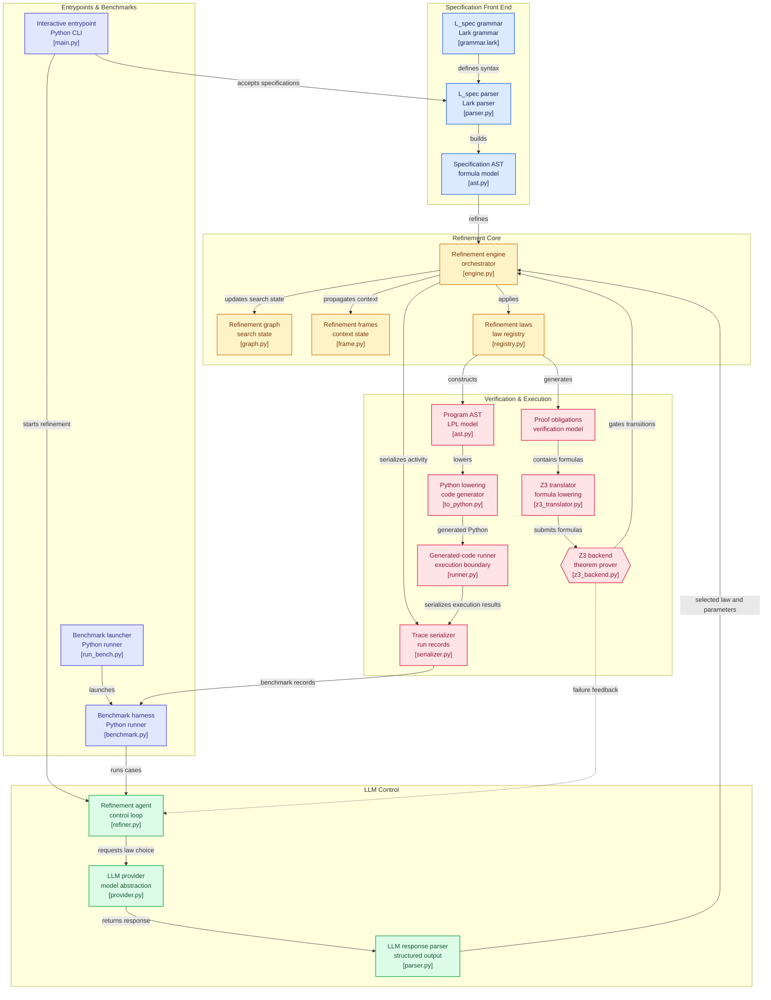

# FormalLLM

**DISCLAIMER: This project is not an original work. It is a completely personal, independent implementation of the architecture described in the paper "Automated Program Refinement: Guide and Verify Code Large Language Model with Refinement Calculus" (Refine4LLM).** 

All core theoretical concepts, refinement laws, the $L_{spec}$ specification language, and the verification loop architectures are derived entirely from the original authors' research.

## Overview
FormalLLM is an implementation of a neuro-symbolic refinement engine. It mathematically bridges the gap between Large Language Models (LLMs) and formal methods (Refinement Calculus) to generate provably correct code. 

Instead of relying on an LLM to generate an entire correct program at once, FormalLLM breaks the problem down into a tree of smaller, mathematically verifiable sub-specifications.

## Architecture



1. **L_spec Parser**: A Lark-based grammar parser that converts textual mathematical preconditions and postconditions into an Abstract Syntax Tree (AST).
2. **Refinement Calculus Engine**:
   - Implements strict refinement laws (Assignment, Sequential Composition, Alternation, Iteration, and Skip).
   - Handles capture-avoidant substitution (alpha-renaming) for quantified variables during refinement steps.
3. **Z3 Verification Backend**: Translates the AST's proof obligations into `z3-solver` constraints. It provides deterministic feedback (`PROVED`, `FAILED` with counterexamples, or `UNKNOWN`).
4. **LLM-Guided Automated Refiner**:
   - An intelligent agent loop that dynamically prompts an LLM with the current refinement state.
   - Evaluates the LLM's chosen law and parameters.
   - Implements a **Counterexample-Guided Feedback Loop** (feeding Z3 failures back into the LLM prompt).
   - Features a robust recursive backtracking/fallback mechanism if the LLM leads the refinement down an unprovable path.

## Benchmarking
The `benchmarks/` directory contains an extensive test suite used to evaluate how well different local LLMs (like Llama 3.1, Qwen 3.5) navigate the formal refinement process.

- **Tier A**: Single terminal laws (e.g., trivially implied postconditions or direct assignments).
- **Tier B**: Structural decompositions (e.g., sequential composition or alternation).
- **Tier C**: Complex, nonlinear problems from the original paper (e.g., tight square root bounds or proper loop invariants).

To reproduce the benchmark runs:
```bash
python benchmarks/run_bench.py --configs llama3.1 qwen3.5-think --laws all
```
The results are output in JSON Lines format and can be analyzed using `benchmarks/analyse.py`.

## Dependencies
- Python 3.10+
- `lark` (for parsing $L_{spec}$)
- `z3-solver` (for automated theorem proving)
- `pytest` (for running the validation suites)

## Installation & Testing

```bash
pip install -r requirements.txt
python -m pytest FormalLLM/tests/
```

## Citation & Attribution
This implementation studies and reproduces the mechanics of:
> **Automated Program Refinement: Guide and Verify Code Large Language Model with Refinement Calculus (Refine4LLM)**
> *(Please refer to the original publication for the full theoretical proofs, completeness guarantees, and algorithmic definitions).*
